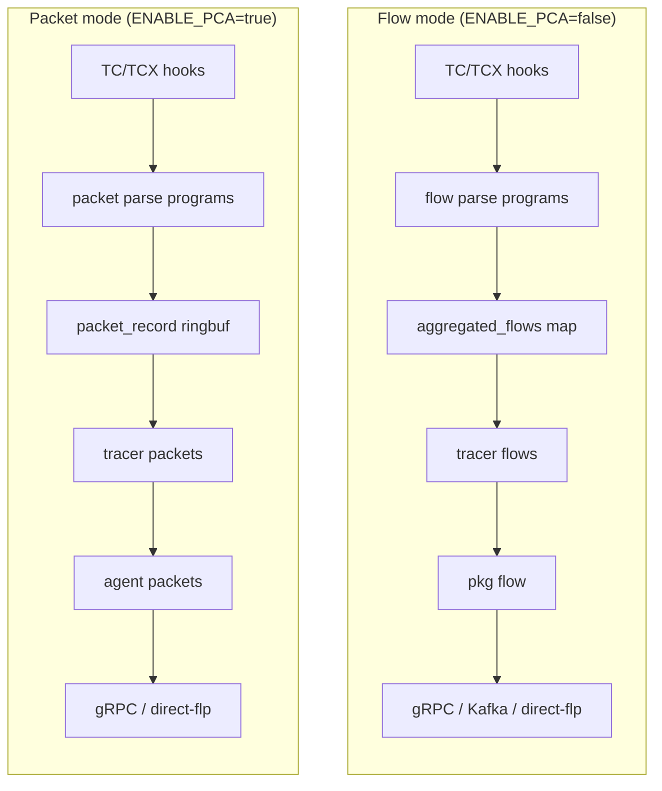

# NetObserv eBPF agent architecture

The agent runs in one of two modes, selected at startup via `ENABLE_PCA`. Each mode loads a **dedicated BPF object**; programs and maps from the other mode are not compiled into that object and are never stripped at runtime.

| Mode | `ENABLE_PCA` | BPF entry | Go bindings |
|------|--------------|-----------|-------------|
| Flow capture (default) | `false` | [`bpf/flows/flows.c`](../bpf/flows/flows.c) | [`pkg/ebpf/flows`](../pkg/ebpf/flows) |
| Packet capture (PCA) | `true` | [`bpf/packets/packets.c`](../bpf/packets/packets.c) | [`pkg/ebpf/packets`](../pkg/ebpf/packets) |

Both modes share the same binary ([`cmd/netobserv-ebpf-agent.go`](../cmd/netobserv-ebpf-agent.go)) and filter implementation ([`bpf/common/filter.h`](../bpf/common/filter.h)). Userspace processing is built as an Extract-Transform-Load pipeline on top of the [Gopipes library](https://github.com/netobserv/gopipes).

## Mode overview


```mermaid
flowchart TD
    subgraph flowMode ["Flow mode (ENABLE_PCA=false)"]
        direction TD
        flowTC[TC/TCX hooks] --> flowParse[flow parse programs]
        flowParse --> flowAgg[aggregated_flows map]
        flowAgg --> flowTracer[tracer flows]
        flowTracer --> flowPkg[pkg flow]
        flowPkg --> flowExport[gRPC / Kafka / direct-flp]
    end

    subgraph packetMode ["Packet mode (ENABLE_PCA=true)"]
        direction TD
        pktTC[TC/TCX hooks] --> pktParse[packet parse programs]
        pktParse --> pktRing[packet_record ringbuf]
        pktRing --> pktTracer[tracer packets]
        pktTracer --> pktPkg[agent packets]
        pktPkg --> pktExport[gRPC / direct-flp]
    end
```

## Documentation map

| Topic | Document |
|-------|----------|
| Flow capture — kernel hooks, maps, userspace pipeline, optional features | [flows/architecture.md](./flows/architecture.md) |
| Packet capture — kernel hooks, ringbuf, userspace pipeline | [packets/architecture.md](./packets/architecture.md) |
| PCA deployment, configuration, CLI integration | [packet-capture.md](./packet-capture.md) |
| Environment variables | [config.md](./config.md) |
| Flow filter rules (`FLOW_FILTER_RULES`) | [flow_filtering.md](./flow_filtering.md) |
| eBPF maps, per-CPU behaviour, collisions | [ebpf_implementation.md](./ebpf_implementation.md) |
| BPF map name consistency checks | `make verify-maps` (`pkg/ebpf/symbols_test.go`) |

## Package layout (userspace)

```text
pkg/
  ebpf/              # shared BPF name constants
  ebpf/flows/        # flow BPF bindings (bpf2go)
  ebpf/packets/      # packet BPF bindings (bpf2go)
  tracer/
    attach/          # shared TC/TCX/netkit attachment
    flows/           # flow-mode fetcher
    packets/         # packet-mode fetcher
  agent/
    flows/           # flow agent entry point
    packets/         # packet agent entry point (ringbuf reader + batching)
    common/          # shared status, interface listener, filter parsing
  config/            # env-based agent config (agent.go + flows/ + packets/)
  flow/              # flow aggregation, accounting, export batching (flow mode only)
  decode/
    flows/           # flow protobuf decode + FLP GenericMap conversion
    packets/         # packet frame parsing + FLP GenericMap conversion
  exporter/
    flows/           # gRPC, Kafka, IPFIX, direct-flp for flows
    packets/         # gRPC, direct-flp for packet capture
  pb/
    flow/            # flow protobuf types + conversion (proto/flow.proto)
    packet/          # packet protobuf types (proto/packet.proto)
```

For component-level API details, see the Go package documentation.
