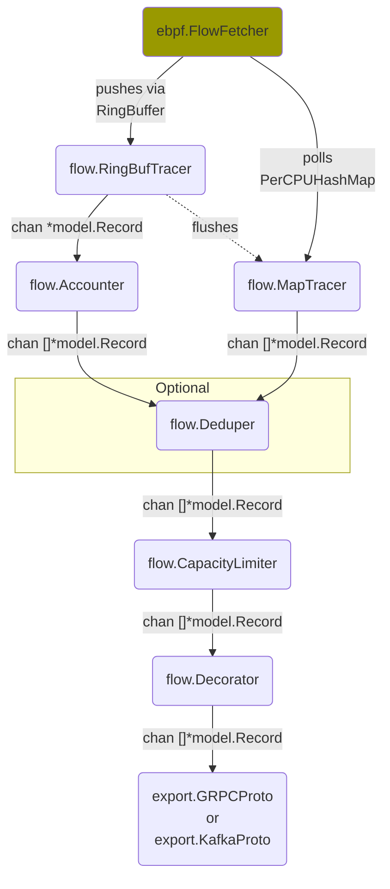

# NetObserv eBPF agent architecture

The eBPF agent is built as an a Extract-Transform-Load pipeline on top of the [Gopipes library](https://github.com/netobserv/gopipes).

The following graph provides a birds' eye view on how the different components are connected and which data they share.

For more info on each component, please check their corresponding Go docs.

