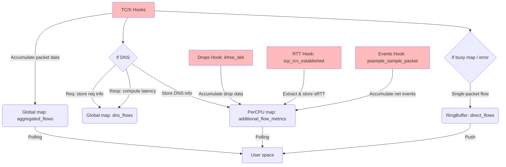
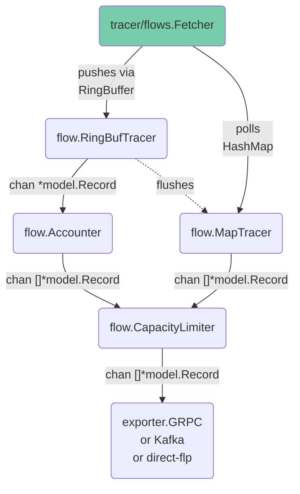

# Flow capture architecture

Flow mode (`ENABLE_PCA=false`) is the default agent operation. It aggregates per-connection statistics in the kernel and exports flow records to flowlogs-pipeline or compatible collectors.

See also: [top-level architecture](../architecture.md) · [flow filtering](../flow_filtering.md) · [eBPF implementation](../ebpf_implementation.md)

## BPF object

Flow programs are compiled from [`bpf/flows/flows.c`](../../bpf/flows/flows.c). Go bindings are generated into [`pkg/ebpf/flows`](../../pkg/ebpf/flows) via bpf2go.

The flow object includes TC/TCX/netkit `*_flow_parse` programs and optional feature hooks (DNS, RTT, packet drops, network events, IPsec, TLS, QUIC, OpenSSL, etc.). It does **not** include packet-capture (`*_packet_parse`) programs.

## Kernel space

Key maps are documented in [ebpf_implementation.md](../ebpf_implementation.md).

## User space

## Userspace packages

| Package | Role |
|---------|------|
| `pkg/tracer/flows` | Load flow BPF object, attach TC/TCX hooks, read maps and ringbuf |
| `pkg/tracer/attach` | Shared interface registration and filter map programming |
| `pkg/flow` | Flow aggregation, accounting, export batching |
| `pkg/agent/common` | Shared agent wiring: interface listener, TLS/SASL, flow filter parsing, status |
| `pkg/agent/flows` | Flow agent: pipeline composition and exporters |
| `pkg/decode/flows` | Flow protobuf decode and direct-flp `GenericMap` conversion |
| `pkg/exporter/flows` | gRPC, Kafka, IPFIX, and direct-flp export |

## Optional features

These are compiled into the flow BPF object and enabled via environment variables. They are **rejected at startup** when `ENABLE_PCA=true`:

| Feature | Env var |
|---------|---------|
| DNS tracking | `ENABLE_DNS_TRACKING` |
| RTT | `ENABLE_RTT` |
| Packet drops | `ENABLE_PKT_DROPS` |
| Network events | `ENABLE_NETWORK_EVENTS_MONITORING` |
| NAT / address translation | `ENABLE_PKT_TRANSLATION` |
| UDN mapping | `ENABLE_UDN_MAPPING` |
| IPsec | `ENABLE_IPSEC_TRACKING` |
| OpenSSL (flow metadata) | `ENABLE_OPENSSL_TRACKING` |
| TLS | `ENABLE_TLS_TRACKING` |
| QUIC | `QUIC_TRACKING_MODE` |
| Ringbuf fallback | `ENABLE_FLOWS_RINGBUF_FALLBACK` |

## Filtering

Flow and packet modes share filter rule syntax (`FLOW_FILTER_RULES`), implemented in [`bpf/common/filter.h`](../../bpf/common/filter.h). See [flow_filtering.md](../flow_filtering.md).
