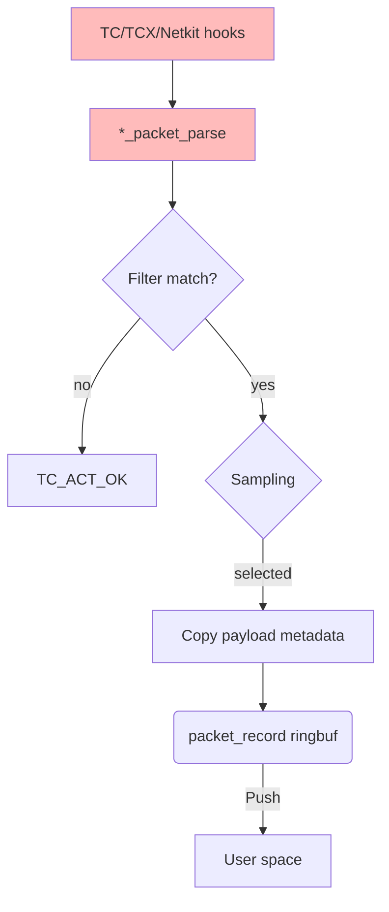
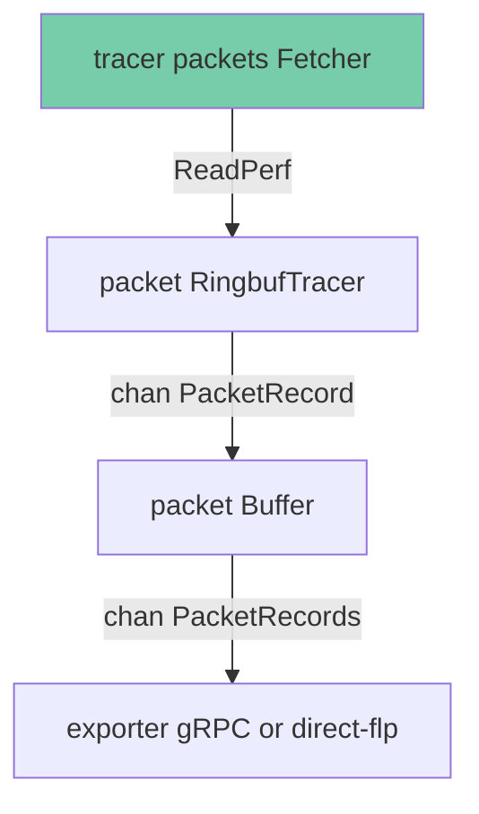

# Packet capture architecture

Packet capture mode (`ENABLE_PCA=true`) exports raw packet payloads from matched traffic via a kernel ringbuf. It is used for on-demand captures triggered by the [network-observability-cli](https://github.com/netobserv/network-observability-cli).

See also: [top-level architecture](../architecture.md) · [PCA deployment & config](../packet-capture.md) · [flow filtering](../flow_filtering.md)

## BPF object

Packet programs are compiled from [`bpf/packets/packets.c`](../../bpf/packets/packets.c). Go bindings are generated into [`pkg/ebpf/packets`](../../pkg/ebpf/packets) via bpf2go.

The packet object includes only `*_packet_parse` TC/TCX/netkit programs plus shared filter maps (`filter_map`, `peer_filter_map`) and the `packet_record` ringbuf. It does **not** include flow aggregation maps, kprobes, or optional flow feature hooks.

## Kernel space

Packets are filtered using the same `FLOW_FILTER_RULES` JSON syntax as flow mode. Rules are programmed into BPF maps before hooks attach (see [`bpf/common/filter.h`](../../bpf/common/filter.h)).

## User space

Unlike flow mode, there is no kernel-side aggregation: each ringbuf event carries one packet (or payload chunk). Userspace batches records before export using `CACHE_MAX_FLOWS` and `CACHE_ACTIVE_TIMEOUT`.

## Userspace packages

| Package | Role |
|---------|------|
| `pkg/tracer/packets` | Load packet BPF object, attach TC/TCX hooks, read ringbuf |
| `pkg/tracer/attach` | Shared interface registration and filter map programming |
| `pkg/agent/common` | Shared agent wiring: interface listener, flow filter parsing, status |
| `pkg/agent/packets` | Ringbuf reader, batching, agent wiring, exporters |
| `pkg/decode/packets` | Packet frame parsing and direct-flp `GenericMap` conversion (`packet_to_map.go`) |
| `pkg/exporter/packets` | gRPC and direct-flp export for packet capture |

## BPF maps and programs

| Name | Type | Purpose |
|------|------|---------|
| `packet_record` | ringbuf | Packet payload events to userspace |
| `filter_map` | LPM trie | Flow filter rules (shared syntax with flow mode) |
| `peer_filter_map` | LPM trie | Peer-CIDR lookup for filter rules |
| `global_counters` | per-CPU array | Internal counters |

Programs: `tc_ingress_packet_parse`, `tc_egress_packet_parse`, `tcx_*_packet_parse`, `netkit_*_packet_parse`.

## Incompatible flow-only options

The following environment variables are rejected at startup when `ENABLE_PCA=true` (see `ValidateForPackets()` in [`pkg/config/validation.go`](../../pkg/config/validation.go)):

`ENABLE_DNS_TRACKING`, `ENABLE_RTT`, `ENABLE_PKT_DROPS`, `ENABLE_NETWORK_EVENTS_MONITORING`, `ENABLE_PKT_TRANSLATION`, `ENABLE_UDN_MAPPING`, `ENABLE_IPSEC_TRACKING`, `ENABLE_OPENSSL_TRACKING`, `ENABLE_TLS_TRACKING`, `QUIC_TRACKING_MODE`, `ENABLE_FLOWS_RINGBUF_FALLBACK`.
